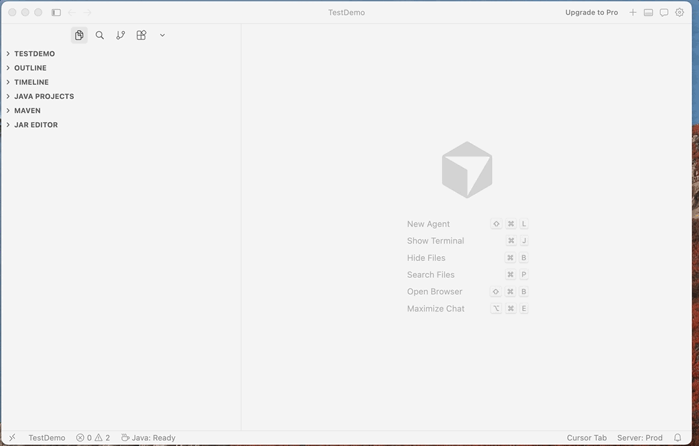
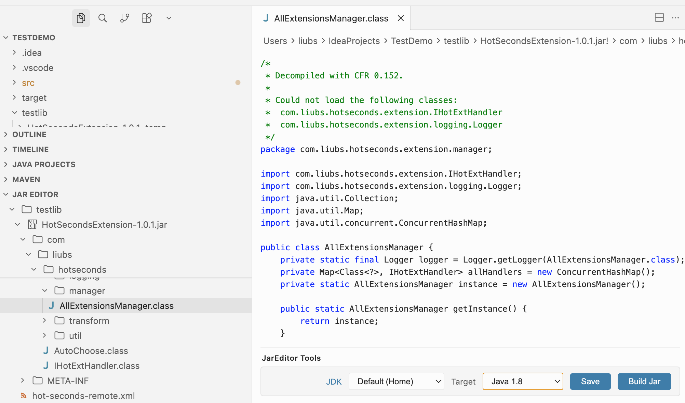
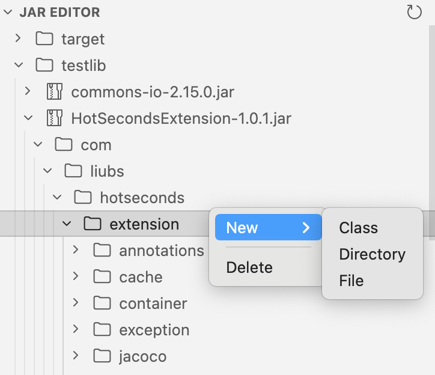

# JarEditor

[English](./README.md) | [中文](./README_zh.md)

JarEditor is a VS Code extension for browsing and editing JAR files directly in Explorer.

It lets you inspect archive contents, edit text entries, open `.class` files as decompiled Java source, add or delete entries, and build changes back into the original JAR.



## Features

- Browse JAR contents from the `JarEditor` view in Explorer
- Open and edit regular text entries inside a JAR
- Open `.class` files as decompiled Java source
- Recompile modified `.class` files when saving
- Add new files, classes, and directories from the context menu
- Delete files or directories from a JAR
- Build edited output back into the original archive

## Usage

1. Open a workspace that contains one or more JAR files.
2. Find them in the `JarEditor` view in Explorer.
3. Open any entry to inspect or edit it.
4. Save changes to `.class` files to compile them.
5. Use `Build Jar` to merge compiled output back into the source JAR.

If you want to edit `.class` files, make sure a JDK is available. You can use `jarEditor.javaHome` or select a JDK from the editor toolbar.



Use the Explorer context menu to create new files, classes, or directories, and to delete existing entries.



## Installation and Running

### Install from VS Code Marketplace

Search for `JarEditor` in the VS Code Extensions view and install it from the Marketplace.

### Build from Source

```bash
npm install
npm run build
```

Open this project in VS Code, then press `F5` to launch an Extension Development Host.

## Licence

Released under the [Apache License 2.0](./LICENSE).
